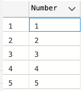

# Exercise 1

Given such sql statements:

```sql
WITH F AS (
    SELECT 0 i UNION ALL
    SELECT i+1 i FROM F WHERE i < 5
)
SELECT i AS [Number] FROM F
```

This CTE will return for you range of numbers:

<div style="text-align: center">
    
</div>

* Encapsulate this CTE in [dbo].[NumbersRange] function. Input parameters are @start as INT, @end as INT. Function must return result as Table with Number as INT column
* By executing this function with:

```sql
SELECT * FROM dbo.GetNumbersRange(1, 5);
```

desired result is:

<div style="text-align: center">
    
</div>

* By executing this function with:

```sql
SELECT * FROM dbo.GetNumbersRange(default, default);
```

desired result is:

<div style="text-align: center">
    
</div>

* By executing this function with:

```sql
SELECT * FROM dbo.GetNumbersRange(5, 1);
```

desired result is:

<div style="text-align: center">
    
</div>

Implement the same functionality with procedure. Procedure cannot return result as table, but you can look at [https://stackoverflow.com/questions/22963939/sql-server-stored-procedure-return-a-table](https://stackoverflow.com/questions/22963939/sql-server-stored-procedure-return-a-table) to find how you can do that in procedure.

* Create procedure [dbo].[NumbersRangeProc]
* Executing given sql:

```sql
DECLARE @Values AS TABLE([Number] INT);
INSERT @Values EXEC dbo.NumbersRangeProc 1, 5;
SELECT * FROM  @Values;
```

must return:

<div style="text-align: center">
    
</div>

* Executing given sql:

```sql
DECLARE @Values AS TABLE([Number] INT);
INSERT @Values EXEC dbo.NumbersRangeProc 5, 1;
SELECT * FROM  @Values;
```

must return:

<div style="text-align: center">
    
</div>

* Executing given sql:

```sql
DECLARE @Values AS TABLE([Number] INT);
INSERT @Values EXEC dbo.NumbersRangeProc;
SELECT * FROM  @Values;
```

must return:

<div style="text-align: center">
    
</div>

